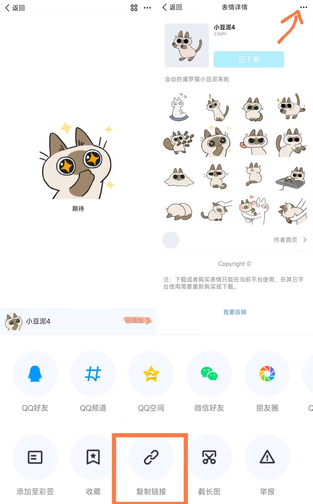

# QQ 表情包下载

~~自用，写得依托答辩，期待有大佬能改成不依托答辩的样子。~~

写出来放在隔壁给某人用后，看上去还比较能用，从 gist 里迁出来好了，也方便接受反馈。

## 依赖安装

```bash
pip3 install selenium requests tqdm
```

使用 selenium 的自动获取 ID 时，记得去 <https://googlechromelabs.github.io/chrome-for-testing/> 下**符合自己当前 Chrome 版本的** chromedriver 文件，并放在 py 脚本可以找到的地方。

## 不一定能看懂的使用指南

~~建议新建个纯英文文件夹把 py 脚本放进去。~~
请准备一个**现代化**的 Python 环境（3.6+），并安装依赖。  
请使用 `python3 main.py` 运行目录中的 `main.py` ，并参照交互操作。
或者，如果你拿到了表情包 ID 想直接下载，你也可以参照下方的命令行使用指南：

```bash
python3 main.py 231867 # 直接调用下方的选项 2，仍包含表情包信息确认流程。

# 如果效率至上，你也可以下载表情包不走确认流程，此时默认你已经知道按动态下载表情包还是静态下载（因为脚本不方便确定）
python3 main.py 231867 --dynamic # 按动态方式下载表情包
python3 main.py 231867 --static # 按静态方式下载表情包
```

### 获取表情包 ID

**upd：更新最简单粗暴的 ID 获取指南：**

1. 在「表情详情」页面，右上角**点击复制链接**，粘贴到一个地方。
2. 正常情况下得到的链接会形如 `https://zb.vip.qq.com/hybrid/emoticonmall/detail?id=235237&traceDetail=xxxx&plg_auth=1&plg_auth=1` ，**查看这里链接中的 ID 值即可**。如示例链接中的 ID 值即为 235237 .



---

- 旧表情包可先尝试在 <http://byaidu.github.io/qqbq-helper/> 搜索一下，有现成 ID 可以直接填进去下。
- 新表情包则需要用 selenium 模拟登录后的表情商店搜索流程。
  - 如果 chromedriver 版本选择无误，在新弹出的窗口中完成 QQ 登录。
    - 那个「登录」按钮一般鼠标点不动，记得在密码框**按下回车**。
    - 提示登录环境风险说明你号被风控了，换一个 QQ 号可解。
  - 登录成功后跳转到搜索框。在上面搜出自己想下载的表情，**点击右侧的「免费」按钮**。
  - 如果成功捕获到了 ID ，浏览器将关闭，请回到脚本终端进行后续流程。

### 下载

- 下载到脚本所在位置的 `downloads` 文件夹下，所以记得别把脚本四处乱放。
- 由于腾讯后端返回数据中 `type` 区分了个寂寞，所以需要在下载时自行确定是否为动态表情。**如在回复中选择 Y ，将下载`gif`格式的动态表情。**

## 免责声明

本脚本仅供学习交流使用，严禁用于商业用途。使用此脚本即**默认您已取得版权方（包括但不限于设计师、深圳市腾讯计算机系统有限公司等）的相关许可**，最终所有权仍然归属于版权方。如有侵权，请联系我删除。
